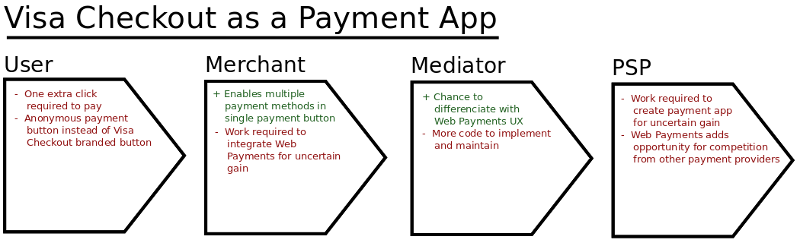

# Web Payments Value Chains

One of the big questions with regard to the upcoming [Web Payments](https://w3c.github.io/browser-payment-api/) specification is whether it will see adoption by users, merchants, browsers and payment providers. To answer this question, we need to look at the value the specification can bring to each of the actors in the payment value chain. This value chain operates on the principle of the _weakest link_, and if there is no value for any one of the actors, the whole chain is not viable.

In this text, I have chosen four different scenarios, and drawn up the respective value chains. The chosen scenarios are "Basic Card Payment", "Android Pay", "Bitcoin Payment" and "Visa Checkout as a Payment App".

Basic card payments are the most prevalent type of payment on the web, and currently this is handled by the user typing in all of his card data in every single merchant. This is a lot of work and a major cause of _digital shopping cart abandonment_.

By storing the card information in the Payment Mediator (e.g. the browser), the user does not have to type in all of his information at every single merchant, which should make for a much more pleasant shopping experience. This does not solve any security related concerns, as all of the data is still sent to the Merchant.

The communication between the Merchant and the Payment Provider is unchanged from the non-web-payments scenario, so the Payment Provider is not relevant for this value chain. We see that the other three actors in this value chain stands to gain from the adoption of this technology, and so it seems viable.

This value chain may also cover Apple Pay and other similar payment methods.

In this value chain, when considering the Chrome browser as the mediator, both the Mediator and the Payment Provider are owned by the same company. Currently Android Pay is only available to native apps in the Play Store, but Google would like to extend the range of Android Pay to also cover browser payments. Although there may well be other incentives for Google to pursue this, this incentive is really all they need. Since there is also value for both users and merchants in enabling Android Pay in the browser, this value chain is viable.

This value chain may also cover other cryptocurrencies and other alternative payment methods.

Although some webshops accept payment by Bitcoin and other cryptocurrencies, I would say that most don't. The addition of Bitcoin payments through Web Payments seems positive for at least a subset of the users, and for the Bitcoin community and exchanges, which might see increased activity.

The case for Mediators and Merchants is, however, less clear. Mediators that already implement the Web Payments standard do not need to do anything special in order to also be able to handle cryptocurrencies, so long as they implement support for third-party applications. Merchants have the least incentive to care about Bitcoin through Web Payments. In addition to the extra work adapting to use the PaymentRequest API, they also have to interface with various cryptocurrency backends. Since Bitcoin is still quite new, there may not be a lot of trust in this as a viable and reliable payment method.

The conclusion is that this value chain is weak. Stronger incentives may be required in order to get merchants to adopt this.

This value chain may also cover other payment methods such as PayPal.

While this scenario is in many cases the ideal scenario, it is also the weakest of the value chains. Compared to the situation where there is a Visa Checkout button on the web page (using [this method](https://arch.developer.visa.com/vme/merchant/documents/Getting_Started_With_Visa_Checkout/Quick_Start_Tutorial.html)), there are few advantages. For the user, there's even a slight disadvantage, since Web Payments introduces an extra payment app selection step that was not necessary with the dedicated Visa Checkout button. For the Merchant, it's kind of a mix of positives and negatives, and the same for the Mediator. The Payment Provider has very little incentive to actively develop a payment app for Web Payments, since he has little reason to believe that this will lead to increased sales. On the contrary, integrating with Web Payments could in this case be seen as a threat to the Payment Provider, since it gives the user more opportunities to select other payment methods.

## Conclusion

There are a number of conclusions that can be drawn from this. The first and most obvious one is that Basic Card Payments and Android Pay (plus probably Apple Pay and whatever Microsoft's payment solution is/will be called) are our strongest bets at this point. I know many are considering Basic Card Payments to be a lesser payment method, but it is also a very important stepping stone for this new technology. While it is true that we would prefer more secure, token-based payment methods such as Visa Checkout, there is much less value to be found in adding these methods, and we have to be careful to not focus too much on these in the initial phase. A good strategy would be to use Basic Card Payments (plus the Android-Pay-like payment methods with browser backing) to introduce the technology to the market. Once people get used to Web Payments and (hopefully) start to demand it from web shops, we can try to build security awareness in order to migrate people to more secure ways of handling credit cards.

Another, less obvious, conclusion pertains to the introduction of third-party payment apps. If we look at the four value chains again, we see that the two most viable scenarios do not depend very much upon support for third-party payment apps. This can be a challenge for the viability of the payment app ecosystem. Especially if it turns out that some browsers can not be bothered to implement third-party payment app registration. As has been suggested in some conversations in the Web Payments Working Group, one solution to this might be to make the imlementation of the app registration part of the specification mandatory, and use social pressure to force mediators to implement the full spec.

Cryptocurrencies end up a bit on the sideline. They do have value for both the users and the cryptocurrency Payment Providers, and Mediators will probably end up implementing what's necessary for this scenario in any case (provided we can make browsers implement payment app registration, which is a prerequisite). The major stumbling block for cryptocurrencies through Web Payments is pretty much the same as for cryptocurrencies in existing web shops; there is not enough incentive for the merchants to overcome the perceived risk and lack of trust in cryptocurrencies.
