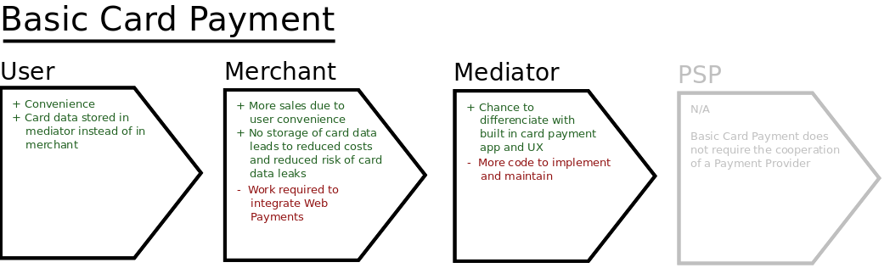
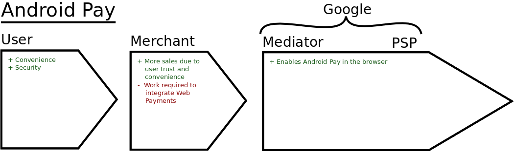
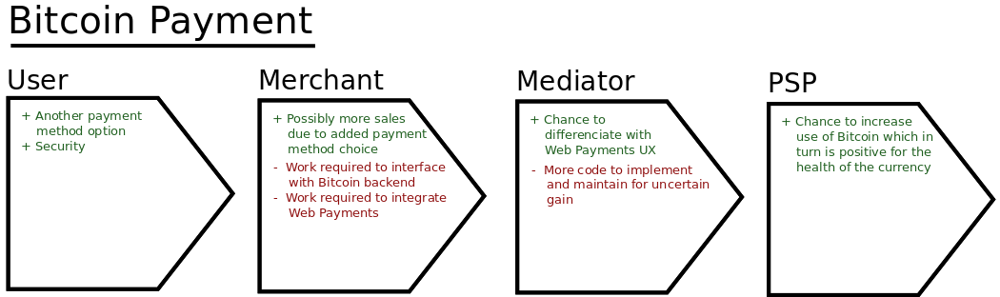

# Web Payments Value Chains

One of the big questions with regard to the upcoming [Web Payments](https://w3c.github.io/browser-payment-api/) specification is whether it will see adoption by users, merchants, browsers and payment providers. To answer this question, we need to look at the value the specification can bring to each of the actors in the payment value chain. This value chain operates on the principle of the _weakest link_, and if there is no value for any one of the actors, the whole chain is not viable.

In this text, I have chosen four different scenarios, and drawn up the respective value chains. The chosen scenarios are "Basic Card Payment", "Android Pay", "Bitcoin Payment" and "Visa Checkout as a Payment App".

Basic card payments are the most prevalent type of payment on the web, and currently this is handled by the user typing in all of his card data in every single merchant. This is a lot of work and a major cause of _digital shopping cart abandonment_.

By storing the card information in the Payment Mediator (e.g. the browser), the user does not have to type in all of his information at every single merchant, which should make for a much more pleasant shopping experience. This does not solve any security related concerns, as all of the data is still sent to the Merchant.

The communication between the Merchant and the Payment Provider is unchanged from the non-web-payments scenario, so the Payment Provider is not relevant for this value chain. We see that the other three actors in this value chain stands to gain from the adoption of this technology, and so it seems viable.

In this value chain, when considering the Chrome browser as the mediator, both the Mediator and the Payment Provider are owned by the same company. Currently Android Pay is only available to native apps in the Play Store, but Google would like to extend the range of Android Pay to also cover browser payments. Although there may well be other incentives for Google to pursue this, this incentive is really all they need. Since there is also value for both users and merchants in enabling Android Pay in the browser, this value chain is viable.

Although some webshops accept payment by Bitcoin and other cryptocurrencies, I would say that most don't. The addition of Bitcoin payments through Web Payments seems positive for at least a subset of the users, and for the Bitcoin community and exchanges, which might see increased activity.

The case for Mediators and Merchants is, however, less clear. Mediators that already implement the Web Payments standard do not need to do anything special in order to also be able to handle cryptocurrencies, so long as they implement support for third-party applications. Merchants have the least incentive to care about Bitcoin through Web Payments. In addition to the extra work adapting to use the PaymentRequest API, they also have to interface with various cryptocurrency backends. Since Bitcoin is still quite new, there may not be a lot of trust in this as a viable and reliable payment method.

The conclusion is that this value chain is weak. Stronger incentives may be required in order to get merchants adopt this.

## DOCUMENT UNDER CONSTRUCTION. MORE TO COME
